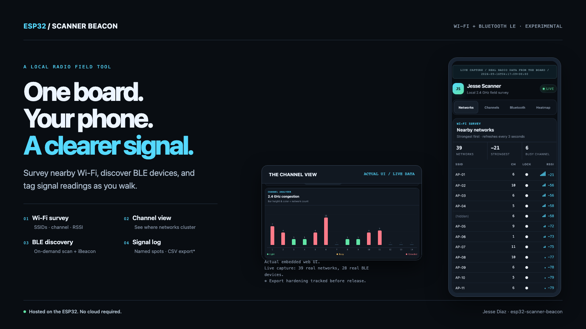
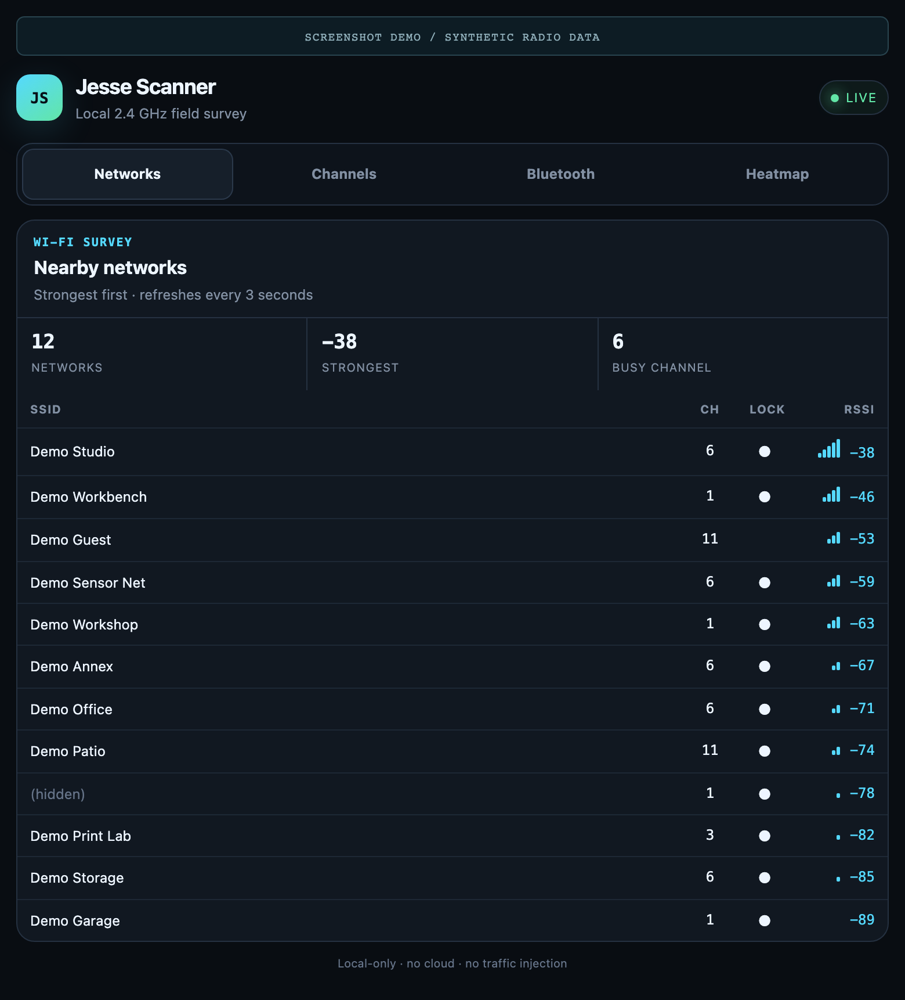
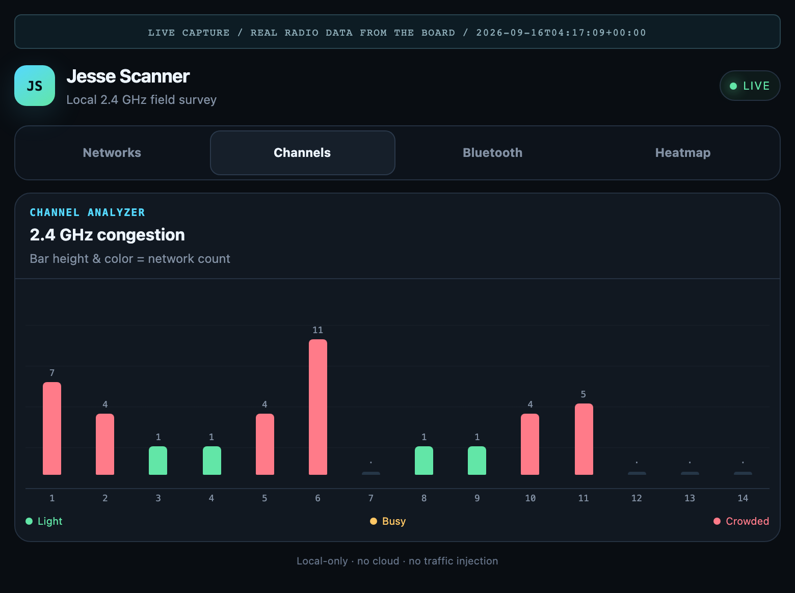
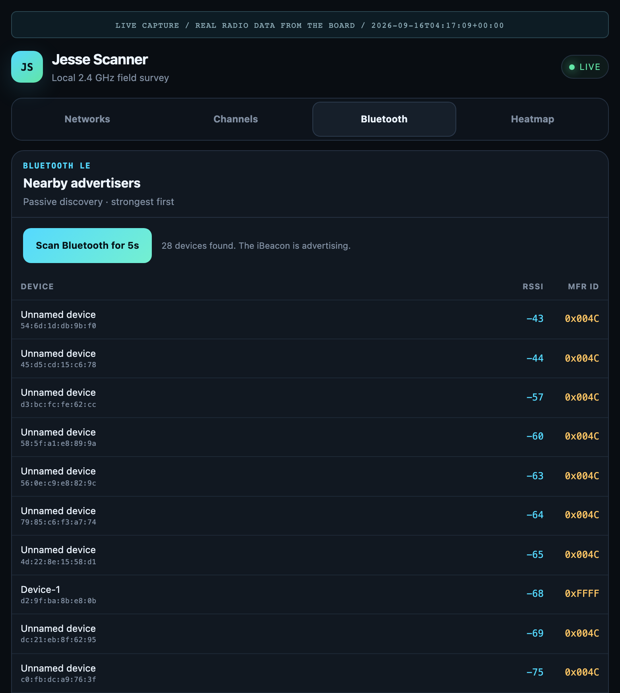
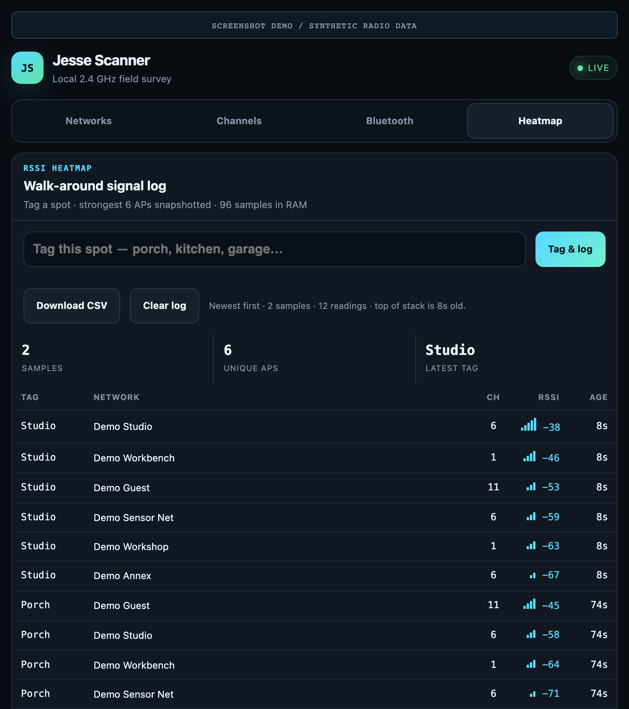

# ESP32 Scanner Beacon

**A local Wi-Fi survey, BLE discovery tool, and iBeacon — one ESP32, one browser.**



Connect your phone to `jesse-scanner`, open `http://192.168.4.1`, and inspect nearby radio activity without a cloud account or a companion app. The board hosts the interface; your phone is the display.

**Platform:** classic ESP32 / ESP32-WROOM-32 · Arduino · PlatformIO  
**Status:** experimental, pre-release. The heatmap correctness blockers are fixed and covered by host tests, and the project is Apache-2.0 licensed. What remains before a public release is the open-AP and unauthenticated-HTTP boundary decision, and a device acceptance pass on reflashed firmware. See the [release checklist](docs/RELEASE_CHECKLIST.md).

## See it in action

These are **screenshots of the real embedded web interface**, rendered in Chromium against data the board actually recorded.

The **Networks**, **Channels** and **Bluetooth** tabs are a live capture taken on 2026-09-16 from an ESP32-WROOM-32 running this firmware: 39 real networks over six sweeps and 28 real BLE advertisers, with real channels, real RSSI, real BLE addresses and real company IDs. Network names are the one thing substituted: SSIDs read `AP-01`…`AP-35` and BLE device names read `Device-1`…`Device-4`, because those columns were other people's, and an SSID list is a location fingerprint even without GPS. Each pseudonym is stable across all six sweeps, so the data stays internally consistent. The raw rows are committed under [`docs/data/`](docs/data). The **walk-around log** is still demonstration data — no walk has been performed yet — and every screenshot states on the image which of the two it is.

Rendering the real UI is still not the same as hardware acceptance testing; see the [release checklist](docs/RELEASE_CHECKLIST.md).

<table>
<tr>
<td width="50%" valign="top">
<h3>01 · Nearby networks</h3>
<p>Sort nearby networks by signal strength. See the SSID, channel, encryption indicator, and RSSI in one view. Captured: 39 real networks, strongest <b>&minus;21 dBm</b>, weakest <b>&minus;96 dBm</b>, 4 hidden.</p>
<a href="docs/images/networks.png"></a>
</td>
<td width="50%" valign="top">
<h3>02 · Channel analyzer</h3>
<p>See where observed networks cluster. Bar height and color represent network count, not measured airtime or interference. Shown: <b>11 of 39</b> networks stacked on channel 6.</p>
<a href="docs/images/channels.png"></a>
</td>
</tr>
<tr>
<td width="50%" valign="top">
<h3>03 · Bluetooth discovery</h3>
<p>Request a five-second passive BLE scan. View advertised names, addresses, RSSI, and manufacturer IDs. The iBeacon pauses during discovery. Captured: 28 real advertisers, only <b>4 named</b> — most modern phones advertise a rotating address and nothing else.</p>
<a href="docs/images/bluetooth.png"></a>
</td>
<td width="50%" valign="top">
<h3>04 · Walk-around signal log</h3>
<p>Tag a spot and collect up to six network readings per snapshot. Inspect the log and use the CSV export control. <b>Demonstration data</b> — this is the one tab not yet backed by a real walk, and no walk-around has been verified on hardware. See the release checklist.</p>
<a href="docs/images/heatmap.png"></a>
</td>
</tr>
</table>

[Full phone screenshot](docs/images/phone.png) · [Screenshot provenance and reproduction](docs/SHOWCASE.md)

## What one capture actually found

Six sweeps and one BLE scan from a single spot, written straight to [`docs/data/`](docs/data) by `tools/capture_live.py`. Numbers below are from that capture, not estimates.

| | |
| --- | --- |
| Sweeps | 6, about 11 s apart — **164 observations** |
| Per-sweep counts | 28, 30, 26, 27, 30, 23 — the radio does **not** see the same set twice |
| Unique networks | **39** |
| Hidden SSIDs | 4 |
| Open networks | 0 — every AP in range was encrypted |
| RSSI range | &minus;21 dBm to &minus;96 dBm |
| Busiest channel | **6**, carrying 11 of 39 networks |
| Channel spread | 1:7 · 2:4 · 3:1 · 4:1 · 5:4 · 6:11 · 8:1 · 9:1 · 10:4 · 11:5 |
| BLE advertisers | **28** in one 5-second passive scan |
| BLE with a name | 4 of 28 |
| Most common BLE vendor | `0x004C` (Apple) on 19 of 28 — rotating addresses, no names |

Two things are worth pulling out, because they are the reason a survey tool has to sweep repeatedly rather than sample once:

- **A single sweep undercounts.** The best sweep saw 30 networks and the worst 23, from the same spot, seconds apart. Any tool that scans once and reports a number is reporting noise.
- **The 2.4 GHz band here is stacked on channel 6.** Eleven networks share it while channels 3, 4, 8 and 9 carry one apiece. That is the kind of thing you can only act on once you can see it.

```sh
# Reproduce against your own board, then re-render the screenshots.
python3 tools/capture_live.py --sweeps 6
python3 tools/capture_showcase.py --fixtures live-fixtures.json
```

`capture_live.py` also pulls `/heatmap.csv` straight from the firmware when you pass `--tags`, which exercises the real C++ exporter instead of a Python stand-in.

## What the board does

| Capability | Implementation |
| --- | --- |
| Wi-Fi survey | Up to 64 results, including hidden SSIDs; displayed strongest-first. Background sweeps are scheduled at roughly 10-second intervals when the radio is available. The page polls every 3 seconds. |
| Channel view | Counts observed networks in channel bins 1–14. Available channels depend on the chip's regulatory configuration; this is not a spectrum analyzer. |
| BLE discovery | On-demand, five-second **passive BLE** scan, with up to 32 stored devices. A manufacturer ID identifies an advertised field, not a verified product identity. |
| iBeacon | Non-connectable advertising between BLE discovery sessions. UUID, major, minor, and advertised measured-power byte are configured in `src/main.cpp`. |
| Signal log | Up to 16 tagged snapshots × 6 network rows, stored in RAM. Oldest snapshots roll off; rebooting clears the log. |
| OTA support | Password-configured ArduinoOTA with two app partitions. The build refuses a placeholder or sub-8-character password. An actual OTA transfer still needs release verification. |
| Browser UI | Self-contained HTML/CSS/JavaScript served from firmware. No external fonts, JavaScript libraries, or cloud APIs. |

### One radio, coordinated jobs

The classic ESP32 shares its 2.4 GHz radio between Wi-Fi and BLE. Channel sweeps can briefly interrupt the access point. The UI retains the previous table during failed polls. BLE discovery waits for the current Wi-Fi sweep, pauses iBeacon advertising, and resumes it afterward. OTA is designed to suspend surveys during an update.

The board is **not radio-silent**: it runs an access point and advertises an iBeacon. Wi-Fi scans currently use Arduino's active-scan default; only BLE discovery explicitly selects passive scanning. There is no deauthentication, jamming, or raw-frame injection feature.

## Hardware

- A classic ESP32 development board with **4 MB flash**, such as an ESP32-WROOM-32 DevKit.
- A USB data cable for the initial flash and a suitable USB power supply for use.
- A phone, tablet, or laptop with Wi-Fi and a browser.

No external display or additional sensor is required. The configured target is `esp32dev`; ESP32-S2/S3/C3 and other variants are not claimed as tested targets.

| Pin | Purpose |
| --- | --- |
| GPIO 2 | Wi-Fi scan heartbeat: approximately 120 ms when a sweep completes. Onboard LED availability/polarity depends on the board. |
| GPIO 4 | Optional BLE status output: heartbeat while advertising, solid during discovery. Use an appropriate resistor if attaching an external LED. |

## Quick start

Install [PlatformIO Core](https://docs.platformio.org/en/latest/core/installation/index.html) or the PlatformIO extension for VS Code.

```sh
git clone https://github.com/JesseDiaz47/esp32-scanner-beacon.git
cd esp32-scanner-beacon

# Build for the configured classic ESP32 target.
pio run -e esp32dev

# Connect the intended board over USB, then upload.
pio run -e esp32dev -t upload
pio device monitor -b 115200
```

If more than one serial device is attached, inspect `pio device list` and add `--upload-port YOUR_PORT` to the upload command. Flashing replaces the firmware on the selected board.

1. Power the board.
2. Join the open Wi-Fi network **`jesse-scanner`**.
3. If your phone warns that the network has no internet, choose to stay connected.
4. Open **http://192.168.4.1** in the browser. Use HTTP, not HTTPS.
5. Start with **Networks**, then try **Channels** or **Bluetooth**.

The access point is not an internet connection. It does not automatically open a captive-portal window. Keep the pinned `espressif32@6.8.1` platform and `min_spiffs.csv` partition layout unless you are deliberately validating a toolchain or partition change.

### Optional: password-configured OTA

The firmware builds without a secret header; OTA is disabled when `OTA_PASSWORD` is not defined.

`OTA_PASSWORD` is checked at compile time, because the access point is open and
an unset password means anyone in radio range can flash the board. The build
fails if the value is still the `change-me` placeholder from
`include/secrets.example.h`, or if it is shorter than 8 characters. To build
with OTA switched off instead, comment the `#define` out entirely.

```sh
cp include/secrets.example.h include/secrets.h
```

Edit the local `include/secrets.h` and replace `change-me` with a strong, unique, non-empty password **before flashing**. The file is ignored by Git. Optional `WIFI_STA_SSID` and `WIFI_STA_PASS` definitions let the board join a trusted Wi-Fi network too.

After an initial USB flash with the OTA configuration, join the board's access point and set the shell's `OTA_PASSWORD` environment variable to the same value, without recording it in shell history. Then run:

```sh
pio run -e ota -t upload
```

The default OTA target is `192.168.4.1`. For an explicitly configured station connection, use `--upload-port BOARD_LAN_IP`. The OTA password does **not** protect the browser interface and is not equivalent to encrypted transport or signed firmware. Never publish a firmware binary built with your personal credentials embedded in it.

## Boundaries worth knowing

- **2.4 GHz Wi-Fi only.** No 5 GHz or 6 GHz survey.
- **Signal readings, not distance.** RSSI varies with antennas, orientation, people, and walls. It is not a calibrated range measurement.
- **A tagged log, not a floor-plan heatmap.** There is no GPS, map interpolation, or coverage overlay.
- **Network count, not channel utilization.** The channel view cannot measure throughput, airtime, noise, or non-Wi-Fi interference.
- **One spot is not a site survey.** The committed capture is six sweeps from a single location. It shows drift and congestion honestly; it does not map a building.
- **Volatile storage.** Download useful readings before rebooting — the log lives in RAM and does not survive a reset. Reboot-loss behaviour is documented but has not been exercised on hardware.
- **An open local interface.** Anyone who can reach the HTTP server can read results, trigger scans, and clear the log. Do not expose it to an untrusted LAN or the internet. “Local” does not mean authenticated.
- **Use responsibly.** Survey only where you have permission and follow local radio/privacy rules. This repository deliberately publishes one real capture, because a survey tool documented with invented numbers is not evidence of anything — but it publishes the *measurements*, not the names. Every count, channel, RSSI and BLE company ID is as captured; the SSID and BLE-name columns are pseudonymised, because those columns belong to neighbours and because an SSID set can be matched against public wardriving databases to locate the capture even with no GPS attached. There is no traffic and no location tag in the data, and the BLE addresses that remain are overwhelmingly the rotating, randomised kind that identify nothing. Publishing a *walk* — repeated readings tied to named places — is a further decision, and this repo has not made it.

## Development and checks

```sh
# Source-contract checks (not hardware integration tests).
python3 -m unittest discover -s tests -p 'test_*.py' -v

# Host-side tests of the real radio coordinator.
mkdir -p .test-bin
c++ -std=c++11 -Wall -Wextra -Werror -Isrc \
  tests/test_radio_coordinator.cpp -o .test-bin/radio
.test-bin/radio

# Host-side tests of the real CSV exporter, round-tripped through a parser.
c++ -std=c++11 -Wall -Wextra -Werror \
  tests/test_heatmap_csv.cpp -o .test-bin/heatmap_csv
.test-bin/heatmap_csv

# Firmware compilation.
pio run -e esp32dev
```

For real-browser presentation checks and screenshot regeneration, follow [docs/SHOWCASE.md](docs/SHOWCASE.md). To capture from your own board, see the commands above.

`tests/test_heatmap_csv.cpp` compiles `src/heatmap_csv.h` — the exact encoder the
firmware ships — and reads its output back with an RFC 4180 parser written
separately from it. Its predecessor kept a private copy of the encoder and a
128-byte `String`, so it reported success while the shipped code wrote JSON
escaping into a `.csv` and truncated long exports. A host encoder test is still
not a device test: downloading the file from the board and parsing it remains on
the [release checklist](docs/RELEASE_CHECKLIST.md).

```text
LICENSE                     Apache License 2.0
NOTICE                      Copyright and attribution notice
src/main.cpp                Radio setup, surveys, HTTP handlers, OTA
src/heatmap_csv.h            Heatmap storage types + host-testable CSV exporter
src/radio_coordinator.h      Host-testable radio state machine
src/ui_page.h                The actual embedded browser interface
include/secrets.example.h    Safe configuration template
platformio.ini              Pinned toolchain and flash partitions
tests/                      Source contracts, radio tests, browser checks
docs/images/                Feature screenshots and cover artwork
docs/data/                  Real capture output: CSVs + provenance manifest
tools/capture_live.py        Pulls a real survey off a running board
tools/capture_showcase.py    Renders the embedded UI from a chosen fixture set
```

## Release status and license

This is a pre-release project, not yet a validated public release. Read the [release checklist](docs/RELEASE_CHECKLIST.md) for correctness issues, verification gaps, and the distinction between browser fixtures and board testing.

Licensed under the [Apache License 2.0](LICENSE) — permissive use, modification
and redistribution, with an explicit patent grant. See [NOTICE](NOTICE) for the
copyright and attribution notice that Apache 2.0 asks redistributors to carry.
